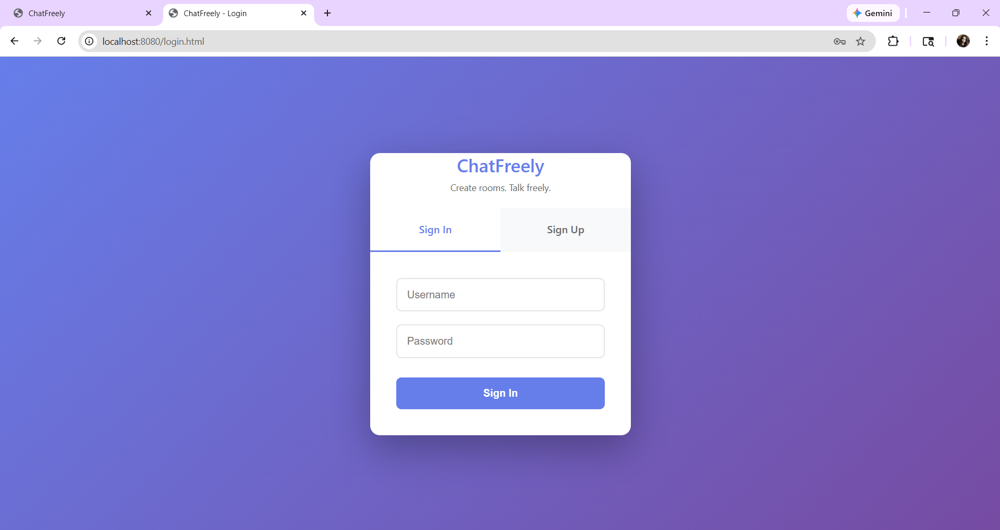
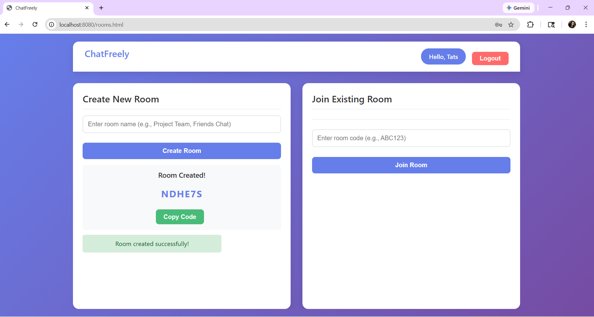
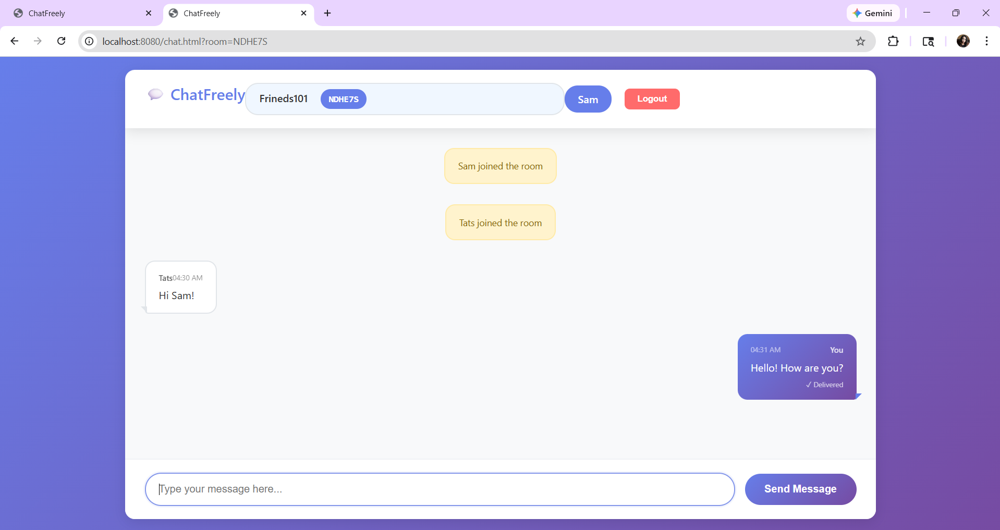

# ChatFreely

ChatFreely is a real-time chat room web application built using Spring Boot and WebSocket. Users can create private rooms, share room codes, and exchange live messages instantly.

The application uses server-side rendering with HTML and CSS and implements bidirectional communication using WebSocket for real-time updates.

## **Features**

- User authentication (Sign In / Sign Up interface)
- Create private chat rooms
- Join rooms using unique room codes
- Real-time messaging using WebSocket
- Live user join notifications
- Message delivery indication
- Clean and responsive UI with custom CSS styling
- Session-based user handling

## **Tech Stack**

### Backend:

Java

Spring Boot

Spring WebSocket

STOMP protocol

Embedded Tomcat server

### Frontend:

HTML

CSS

JavaScript

### Other:

H2 Database 

Maven build system

## Architecture Overview

- The application follows a simple client-server model:

- Spring Boot manages REST endpoints and WebSocket configuration.

- WebSocket enables full-duplex communication between clients and server.

- STOMP protocol is used for message routing inside chat rooms.

- Each room is dynamically generated with a unique room code.

- Users subscribe to room-specific channels for message broadcasting.

## **How It Works**

→ User logs in.

→ User creates a new chat room.

→ The server generates a unique room code.

→ Another user joins using that room code.

→ Messages are sent via WebSocket and broadcast instantly to all connected users in that room.

→ Join notifications and delivery status are displayed in real time.

## Screenshots 
### Sign In / Sign Up Page

### Room Selection

### Chat Interface

## Running the Project Locally

Clone the repository:

1. git clone https://github.com/yourusername/chatfreely.git

2. Navigate into the project:

    cd chatfreely

3. Run using Maven:

    mvn spring-boot:run

4. Open browser:

    http://localhost:8080

## Author

Tasnia Jasim Tahiti  
Master’s Student in Computer Engineering  
Spring Boot • Real-time Systems • Backend Development  
